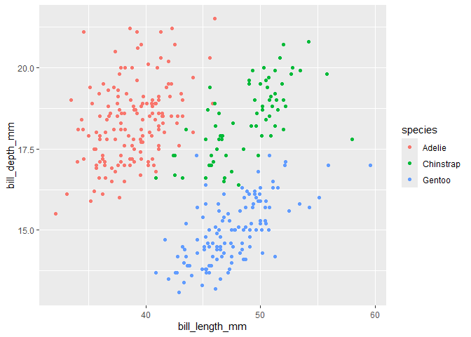

# week06_b_quarto
Jake Reichard

<script src="week06_b_quarto_files/libs/kePrint-0.0.1/kePrint.js"></script>
<link href="week06_b_quarto_files/libs/lightable-0.0.1/lightable.css" rel="stylesheet" />

# Introductions

Today, we are learning about how to work with figures

## Load Libraries

``` r
library(tidyverse)
library(here)
library(palmerpenguins)
library(kableExtra)
```

## Make a Plot

``` r
penguins %>% 
  ggplot(aes(x= bill_length_mm, y= bill_depth_mm, color= species))+
  geom_point()
```

<div id="fig-penguin">



Figure 1: This is a figure showing bill length by bill depth

</div>

When you look at <a href="#fig-penguin" class="quarto-xref">Figure 1</a>
we can see there is a positive relationship between bill length and bill
depth.

``` r
penguins %>% 
  group_by(species) %>% 
  summarise(bill_mean = mean(bill_length_mm, na.rm = T)) %>% 
  kbl() %>%  #make it a kable table
  kable_classic() %>% #adds a theme to table
  row_spec(2, bold = TRUE, color = "black", background = "lightgreen") %>%  #how to highlight a row and add color
  kable_styling(full_width = F) #doesn't make it too wide
```

<div id="tbl-penguin">

Table 1: The mean bill length

<div class="cell-output-display">

| species   | bill_mean |
|:----------|----------:|
| Adelie    |  38.79139 |
| Chinstrap |  48.83382 |
| Gentoo    |  47.50488 |

</div>

</div>

The table <a href="#tbl-penguin" class="quarto-xref">Table 1</a> has
information on the mean bill lenght by speciecs.
