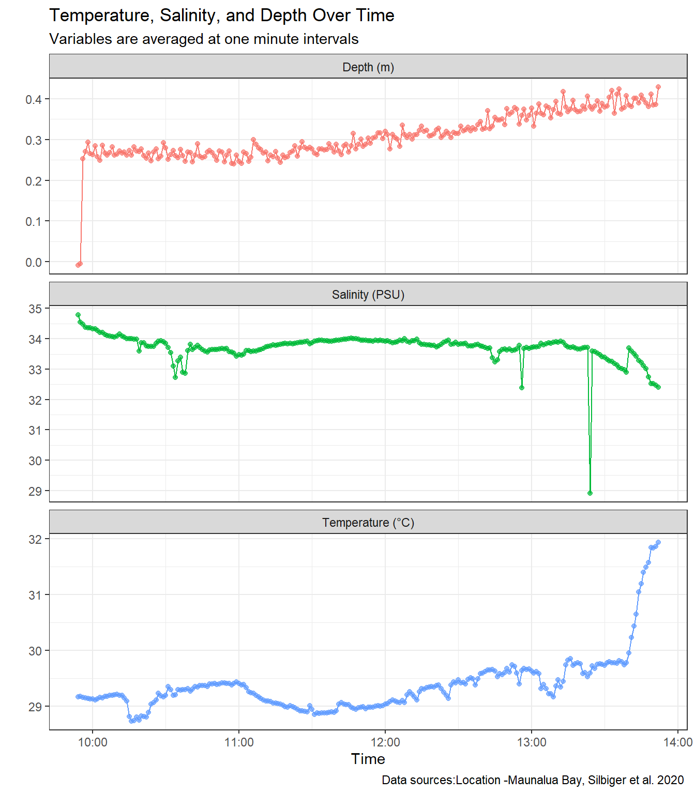

# Week 6 Homework
Jake Reichard

<script src="week06_hw_quarto_files/libs/kePrint-0.0.1/kePrint.js"></script>
<link href="week06_hw_quarto_files/libs/lightable-0.0.1/lightable.css" rel="stylesheet" />

- [**Introduction**](#introduction)
  - [**Load Libraries**](#load-libraries)
  - [**Load in data**](#load-in-data)
  - [**Format the data**](#format-the-data)
  - [**Data Summarization**](#data-summarization)
    - [Mean by Minute](#mean-by-minute)
    - [Mean by Day](#mean-by-day)
    - [Mean ploted over time](#mean-ploted-over-time)

# **Introduction**

Sampling was conducted in Maunalua Bay on the island of Oahu. Sensors
were towed via a kayak to collect various environmental data.

**Parameters collected**

- Temperature
- Salinity
- Depth

### **Load Libraries**

``` r
library(tidyverse)
library(here)
library(lubridate)
library(viridis)
library(kableExtra)
```

### **Load in data**

*Remember to check the first rows of data*

``` r
conddat <- read.csv(here("week_05","data","CondData.csv"))
depthdat <- read.csv(here("week_05", "data","DepthData.csv"))

head(conddat)
head(depthdat)
```

### **Format the data**

``` r
#format the date to be ymd_hs
conddat$date <- mdy_hms(conddat$date) 
depthdat$date <- ymd_hms(depthdat$date)

#round cond data to the nearest 10 seconds
conddat <- conddat %>% 
  mutate(rounded_date = round_date(date, "10 second"))

#join data that only has matching data so there is no na
joined_dat <- conddat %>% 
  inner_join(depthdat, by = c("rounded_date" ="date")) #joining with the rounded date column
```

### **Data Summarization**

#### Mean by Minute

``` r
#mean of depth temperature and salinity by min
dat_summary_min <- joined_dat %>%
  mutate( minute =floor_date(date, "minute")) %>% 
  group_by(minute) %>% 
  summarise( temp_mean = mean(Temperature, na.rm =T),
             sal_mean = mean(Salinity, na.rm =T),
             depth_mean = mean(Depth, na.rm =T),
             .groups = "drop")
```

#### Mean by Day

``` r
#mean by day
joined_dat %>%
  mutate(day = floor_date(date, "day")) %>% 
  group_by(day) %>% 
  summarise("Mean Temperature (C)" = mean(Temperature, na.rm = T),
            "Mean Salinity" = mean(Salinity, na.rm = T),
            "Mean Depth (m)" = mean(Depth, na.rm = T),
            .groups = "drop") %>% 
  kbl() %>%  #make it a kable table
  kable_classic() %>% #adds a theme to table
  row_spec(1, bold = TRUE, color = "black", background = "lightblue") %>%  #how to highlight a row and add color
  kable_styling(full_width = F) %>%  #doesn't make it too wide
column_spec(1:4, border_right = TRUE) #adds border to the right
```

<div id="tbl-mean">

Table 1: The mean temperature, salinity, and depth for the day.

<div class="cell-output-display">

| day        | Mean Temperature (C) | Mean Salinity | Mean Depth (m) |
|:-----------|---------------------:|--------------:|---------------:|
| 2021-01-15 |             29.37742 |      33.71073 |      0.3085941 |

</div>

</div>

<a href="#tbl-mean" class="quarto-xref">Table 1</a> has information on
the mean temperature, salinity, and depth that were observed for the
day.

#### Mean ploted over time

``` r
#pivot to longer to graph multiple variable across time
dat_sum_long <- dat_summary_min %>% 
  pivot_longer(cols = temp_mean:depth_mean,
               names_to = "Variables",
               values_to = "Values")

#make cleaner labels for figure, will insert it into facet wrap 
variable_labels <- c(temp_mean = "Temperature (°C)",
  sal_mean = "Salinity (PSU)",
  depth_mean = "Depth (m)")

#make a plot that plots temp, sal, and depth over time
print(  
 ggplot(dat_sum_long, aes(x = minute, y = Values, color = Variables)) +
  geom_line() +
  geom_point(alpha = 0.7)+
  facet_wrap(~ Variables, scales ="free_y", ncol = 1, #makes each scale to each variables y values
             labeller = labeller(Variables = variable_labels)) +
  
  #make labels and titles 
  labs(title = "Temperature, Salinity, and Depth Over Time",
         subtitle = "Variables are averaged at one minute intervals",
         caption =  "Data sources:Location -Maunalua Bay, Silbiger et al. 2020 ",
       x = "Time", 
       y = "") +
  theme_bw()+
  theme(legend.position = "none")
)
```

<div id="fig-mean">



Figure 1: This is a figure shows the mean parameters over time.

</div>

When you look at <a href="#fig-mean" class="quarto-xref">Figure 1</a> we
can see that when depth is relatively constant so are salinity and
temperature.
